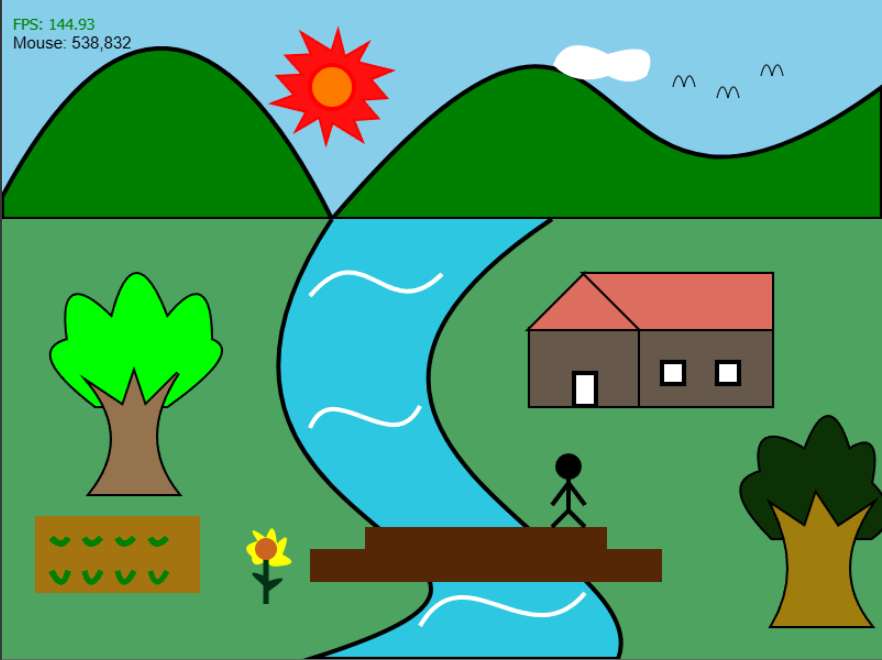

# Assignment 01 : canvas 2D graphic

> **เป้าหมาย:** วาดภาพทิวทัศน์ด้วย **HTML5 Canvas + JavaScript** ตามที่เรียนใน Week02–Week03 โดย **ห้ามใช้ `drawImage()`** ทุกกรณี

---

## สรุปงาน 
- วาดฉากทิวทัศน์ 2D ใน `<canvas>` ด้วยคำสั่งพื้นฐานของ Canvas (เส้น/รูปทรง/ไล่สี ฯลฯ)
- **องค์ประกอบที่ต้องมีครบ 7 อย่าง**
  1) ท้องฟ้า 
  2) ภูเขา 
  3) พระอาทิตย์
  4) ท้องนา
  5) ต้นไม้
  6) บ้าน/กระท่อม
  7) แม่น้ำ
> แรงบันดาลใจในการวาดรูปนี้ : นำมาจากตัวอย่างของอาจารยอดเพชรมา
ใช้โดยประยุกต์เเละเพิ่มองค์ประกอบเล็กน้อย
> 

## วิธีรันงาน
**วิธีที่ 2 (แนะนำใน VS Code):** ติดตั้งส่วนเสริม *Live Server* → คลิกขวา `index.html` → *Open with Live Server*

---

## วิดีโออธิบาย (≥ 5 นาที ต้องมี)
1) แนะนำตัวสั้น ๆ  
2) โชว์ผลลัพธ์ที่รันจริง  
3) อธิบายลำดับโค้ดส่วนสำคัญ → ผลที่เกิด  
4) แก้โค้ดเล็กน้อยแล้วโชว์ผลต่าง (เช่น เปลี่ยนสี/ตำแหน่ง/ความเร็วเมฆ)  
5) สรุปสิ่งที่เข้าใจ/ทักษะที่ได้
[🎬 คลิกดูวิดีโออธิบายผลงาน](https://youtu.be/qXCYUH2CPCE)
---

## เช็กลิสต์ก่อนส่ง
- [✅] มีองค์ประกอบครบทั้ง 7 อย่าง  
- [✅] ไม่ใช้ `drawImage()` และไม่ใช้ไลบรารีช่วยวาด  
- [✅] โค้ดรันได้จริง (เปิดหน้าเว็บแล้วเห็นภาพครบ)  
- [✅] โครงสร้างโค้ดอ่านง่าย แยกฟังก์ชันพอเหมาะมีคอมเมนต์สั้นๆ 
- [✅] README ระบุวิธีรัน + ใส่ลิงก์วิดีโออธิบาย  
- [✅] วิดีโอ ≥ 5 นาที และมี “แก้โค้ดแล้วผลต่าง” ให้เห็นชัด

---

## สรุปสิ่งที่ได้ในการวาดฉากแรกบน Canvas! ✨ 
1) ได้ใช้ความรู้จาก Week2-3 มาประยุกต์ใช้
2) ได้เเก้ปัญหาเฉพาะหน้าเมื่อมีการเกิดบัค ฯลฯ
3) ได้สนุกกับการวาดภาพบน Canvas